# Weekly progress journal

## Instructions

In this journal you will document your progress of the project, making use of the weekly milestones.

Every week you should 

1. write down **on the day of the lecture** a short plan (bullet list is sufficient) of how you want to 
   reach the weekly milestones. Think about how to distribute work in the group, 
   what pieces of code functionality need to be implemented.
2. write about your progress **until Tuesday, 11:00** before the next lecture with respect to the milestones.
   Substantiate your progress with links to code, pictures or test results. Reflect on the
   relation to your original plan.

We will give feedback on your progress on Tuesday before the following lecture. Consult the 
[grading scheme](https://computationalphysics.quantumtinkerer.tudelft.nl/proj1-moldyn-grading/) 
for details how the journal enters your grade.

Note that the file format of the journal is *markdown*. This is a flexible and easy method of 
converting text to HTML. 
Documentation of the syntax of markdown can be found 
[here](https://docs.gitlab.com/ee/user/markdown.html#gfm-extends-standard-markdown). 
You will find how to include [links](https://docs.gitlab.com/ee/user/markdown.html#links) and 
[images](https://docs.gitlab.com/ee/user/markdown.html#images) particularly.

## Week 1
(due 22 April 2025, 11:00)

@npaarts

I started creating a basic structure of the polymer simulation.
After I finished doing that I continued with creating parts of the notes until I finally had enough.

During this time we implemented the end-to-end distance as a function of length

And also the gyration

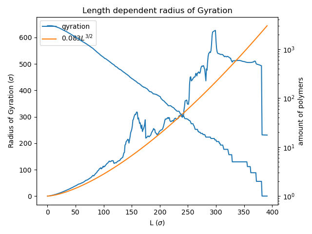

The code is already using numpy with pre-allocated arrays where possible so it's quite performant.

@rjuyal

I reviewed the merge requests and added the errors(computed analytically) for the weighted averages graphs computed using Rosebluth method for 2D polymers.

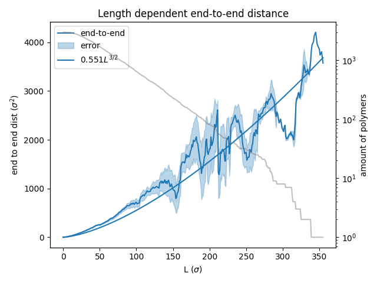

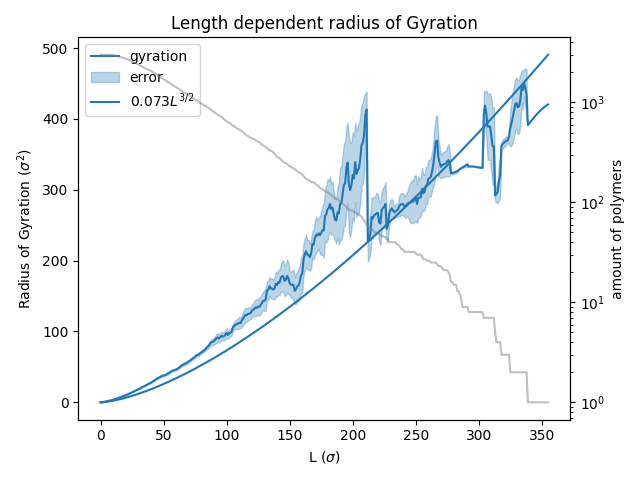

At some point we no longer see errors. This is probably because at that point, there is only 1 chain and since the analytical error formula has a N-1 term in the denominator, we get divide by zero. This is expected since we cannot really compute standard deviation of a single entry.

We are considering to look into the estimation(L$^{3/2}$) fitted by scipy and the errors associated with that as well.

@mankritsingh

I reviewed the code and was evaluating some possible extensions of the idea (maybe adding copolymers, A-B with different properties etc.) \
Refactored the code to make it more modular here: !8

The weights used in the Rosebluth method depend on the number of available directions for the polymer to grow. With every new step we multiply the weight with the available directions, and by doing so we try to take into account the bias introduced by choosing only one of the many possible paths.

## Week 2
(due 29 April 2025, 11:00)

### Planning

- [x] add configuration file @mankritsingh
- [x] use sigma for the opt fit @rjuyal
- [x] fix divide-by-zero error @mankritsingh (done in !14)
- [x] create docstrings @npaarts (done in !11)
- [ ] verify correctness of 2d and 3d
  - [ ] unit tests @everyone
    - [ ] end-to-end produces correct numbers
    - [ ] gyration produces correct numbers
    - [ ] next step functions produce correct next steps
    - [x] perm removes/creates the correct polymers (done in !16)
- [x] decide what we're going to research @everyone
- [x] add typehints where reasonable @npaarts (done in !11)
- [x] add `amount of polymers` to the legend @npaarts (done in !10)
- [x] change fit name to mention `fit` (and color) @npaarts (done in !10)
- [x] default `do_perm = true` @npaarts (done in !9)
- [x] rename `mean_r2` and `error_r2` in `plot_end_to_end` and `plot_gyration` @mankritsingh (done in !13)

### What we want to research

options for what to do
- compare PERM to the pivot algorithm.
  - would need to find pivot implementation details
- create animated chain creations for improved visualisation.
  - trivial
  - not enough on it's own
- multiple simultaneous starting positions and their influence on observables.
  - no idea yet if it's interesting
  - needs major refactoring
- calculating entropy / fractal dimension
  - don't know how to go about it
  - interesting if we find out
- non-square lattice (like hexagons, or triangles)
  - interesting
  - needs some refactoring
  - [useful site](https://www.redblobgames.com/grids/hexagons)

From these points we have decided to start by implementing animations to use as a simple
sanity check, after that we will continue by creating non-square lattices.
If we have a lot of time after this, we will try to calculate the polymer entropy.

@mankritsingh \
This week's original milestones were already complete, so I added some unit tests in !16 \
Also made some basic improvements (removed some errors etc.) like in Merge Requests !13 and !14 \
In addition to this, I spent some time planning our "what we want to research" section in the beginning of the week, since we had a lot of ideas and we took some time discussing them.

@rjuyal

This week I worked on making the scipy curve fit take into account the errors we had computed analytically last week and also computed the R2 score to have a measure of goodness of fit to validate(!15).
I also reviewed merge requests.

Basic simulation(with R2 score to see goodness of fit)

Rosenbluth 2D

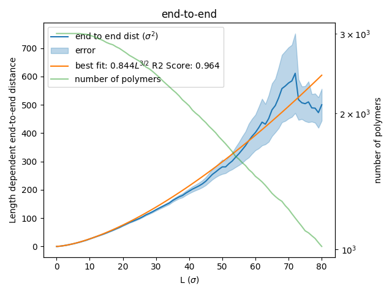

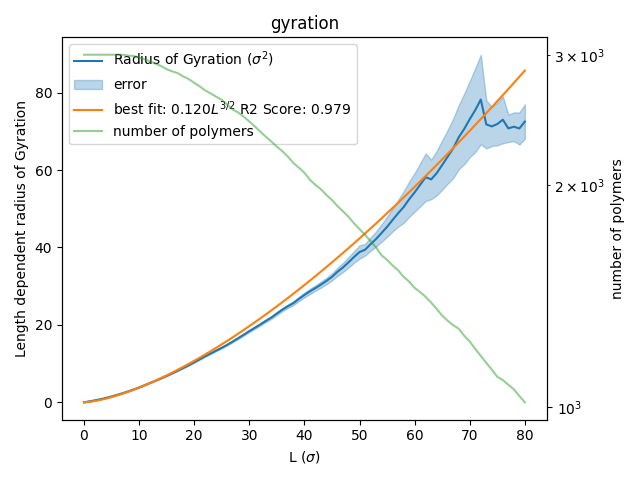

PERM 2D

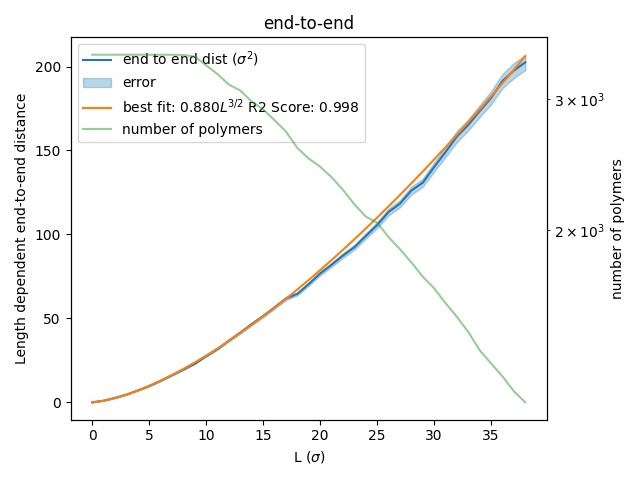

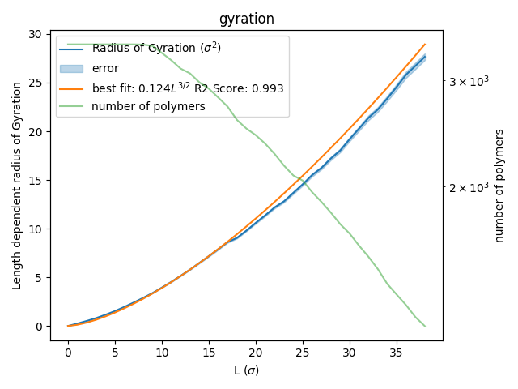

Rosenbluth 3D

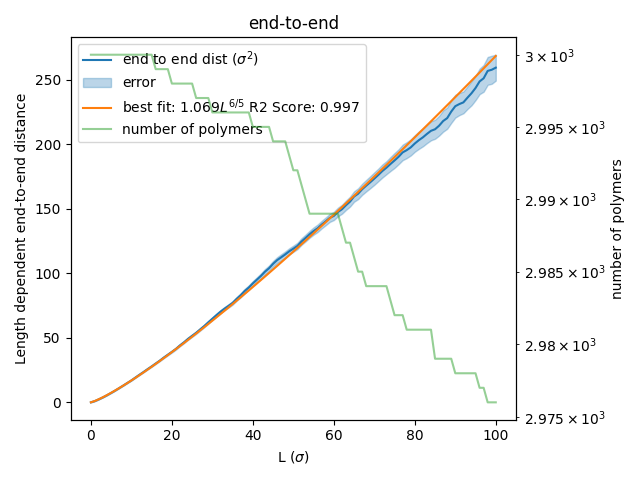

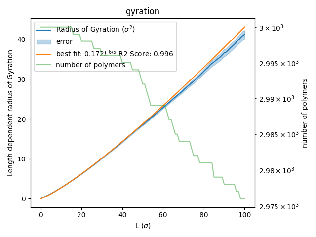

PERM 3D

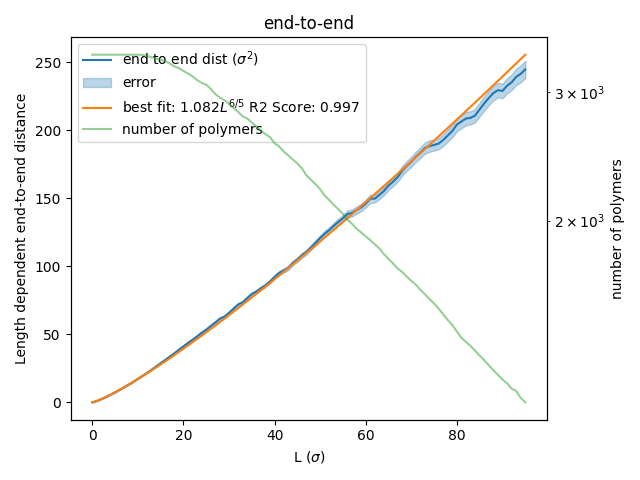

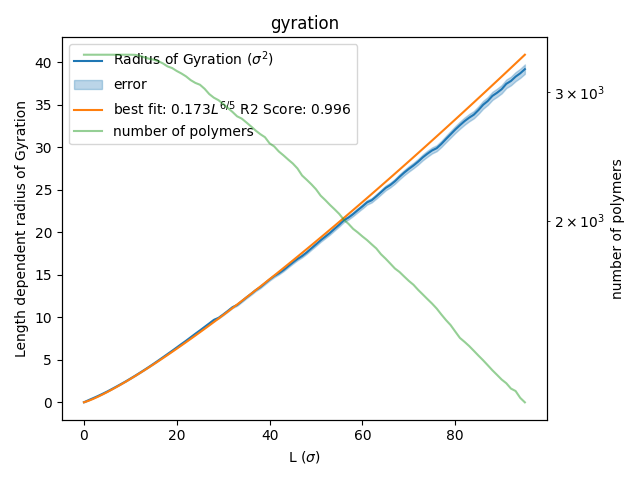

@npaarts

I've not been able to do as much this week, we decided on Wednesday that I had to do some small things, like adding labels to the axes. 
After that I made animations to use as a sanity check of the produced polymers. This uncovered a bug where polymers would sometimes teleport to the origin again. 
When I fixed that bug I was done for the week(!12).

Animation of polymers in 2D 

Animation of polymers in 3D

## Week 3
(due 6 May 2025, 11:00)

### Planning

- [ ] Add seed for consistent comparisons @rjuyal
- [ ] Fine tune threshold @rjuyal
- [x] Try different lattice like hexagon and triangle @mankritsingh
- [x] Profile performance @npaarts

@mankritsingh

I worked on extending our code to non-squared lattice (triangle and hexagon) in Merge Request !17 \
Made the graph exponent free to optimize and fixed some bugs / improved plot titles in !21 \
Reviewed other Merge Requests

Triangular lattice: \

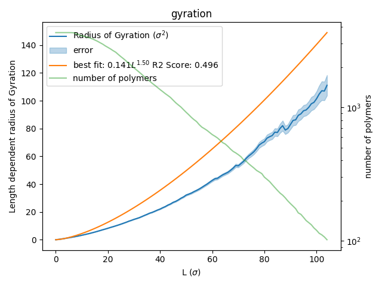

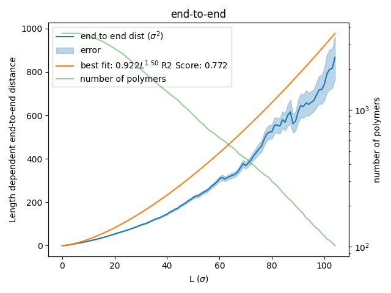

Hexagonal lattice: \

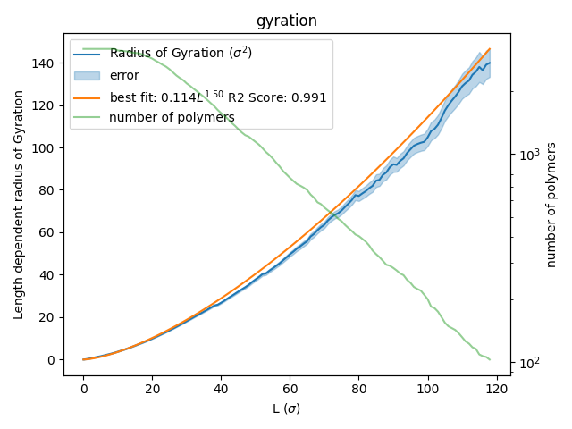

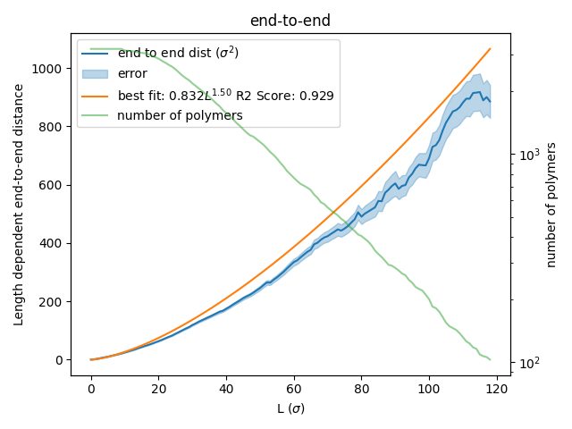

We observe that the end-to-end and gyration graphs for triangular and hexagonal lattice are approximately similar to the squared lattice.

@npaarts

After I came back from my holiday I worked on profiling and optimising our code.
I started by making a flamegraph of the state before optimising so I didn't optimise already fast enough code.
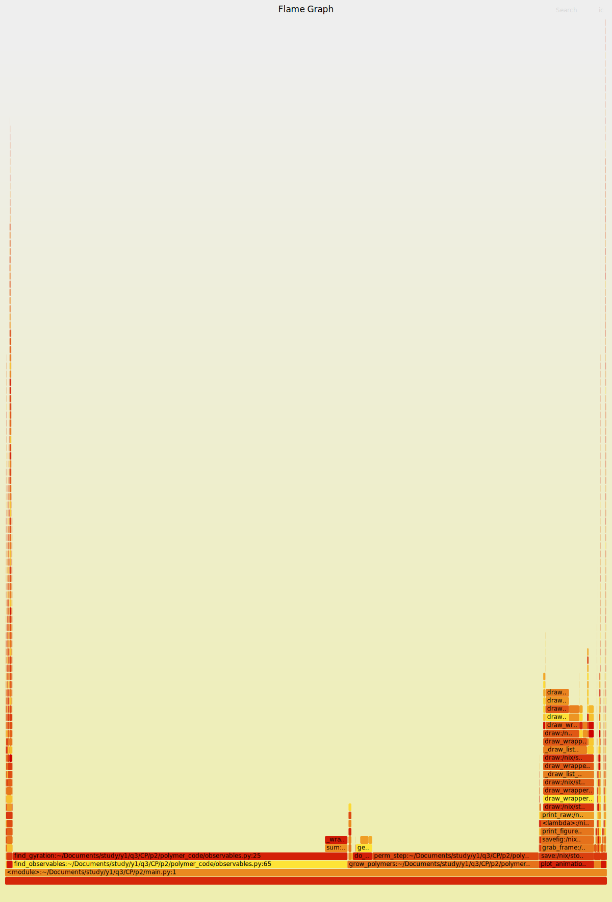](./journal/week3/pre-opt.png)

From this I could quickly spot two main bottlenecks, the function to calculate the gyration
and the function that did PERM for a simulation steps. I started by focussing on the calculations of the gyration.

For this part I found that we were doing an `O(n^2)` calculation for an unneccesarily big `n`,
after reducing the maximum we calculated to only be the neccesary value we get the following flamegraph.
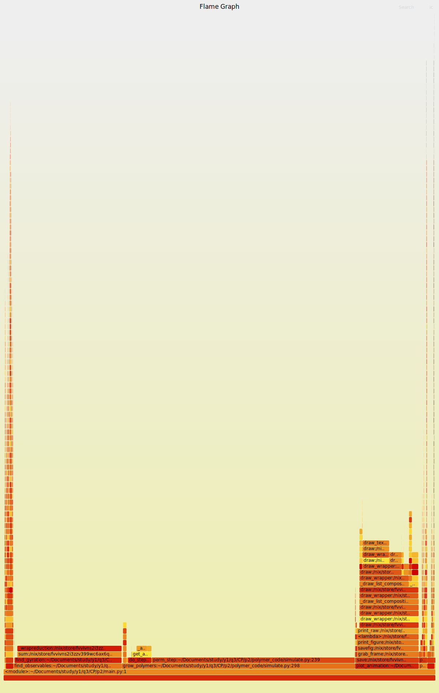](./journal/week3/gyration-max-step.png)

Now the biggest performance cost was the PERM step, especially the part where we were concatenating
the enriched chains to the big arrays. I fixed this issue by allocating a 50% extra at the start
(with the default config only about 15% extra chains get generated) so that no re-allocations need to happen.
This greatly reduced the resources the function needed so we're left with the following performance chart.
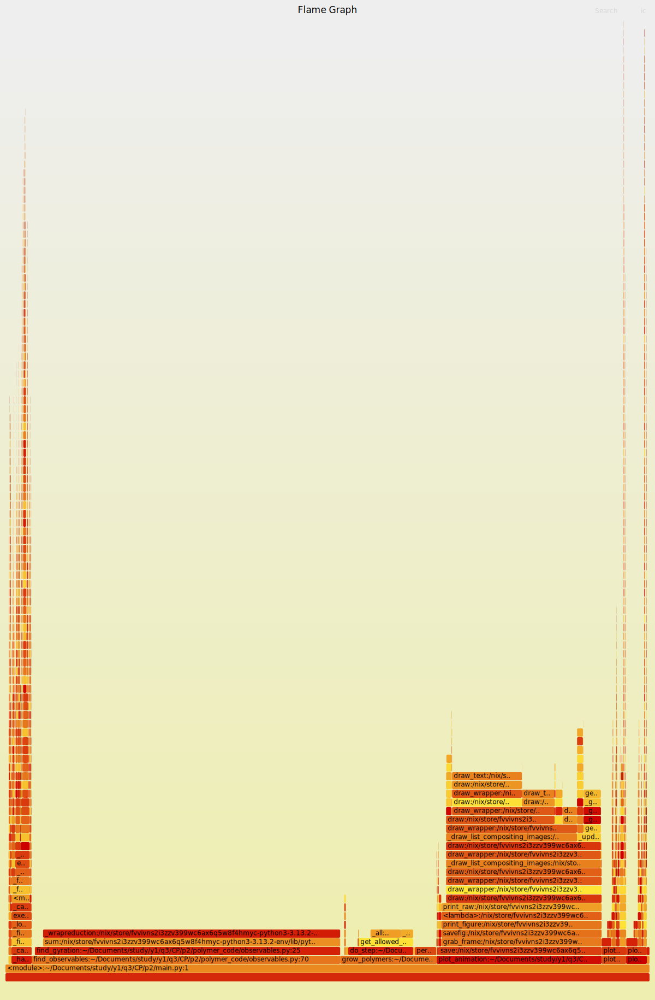](./journal/week3/perm-no-concat.png)

These improvements turned out to be quite significant together, while it may still be possible
to improve the calculations of gyration further I didn't see value in the extra effort for now since
everything is already quite performant.

## Reminder final deadline

The deadline for project 2 is **13 May 23:59**. By then, you must have uploaded the report to the repository, and the repository must contain the latest version of the code.
